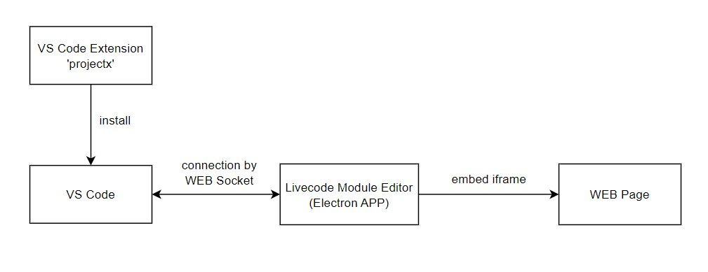
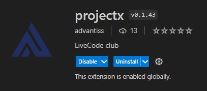
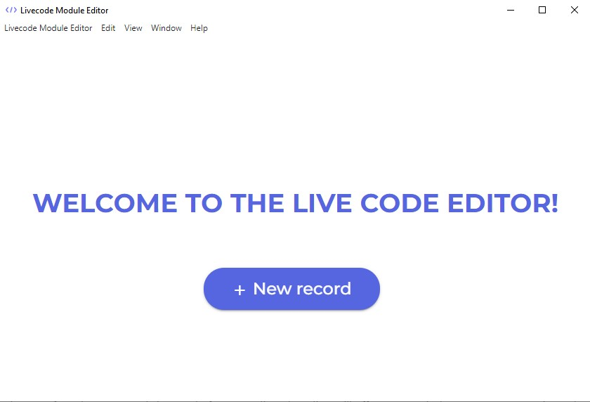
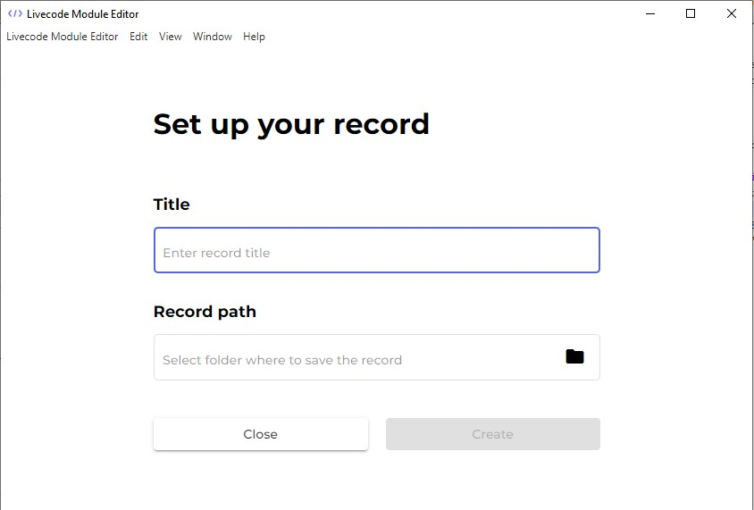

# Overview

**Livecode** is designed to record the process of writing code. It can be used for educational purposes. You can record writting of entire application from scratch, as well as its individual features or functionalities (it's up to you). While creating a recording, you can record video from webcam, as well as video from the monitor screen. After recording, the created project code is pushed to github. The created record can be viewed, cut out unnecessary fragments or add highlights to the video. You can create records as much as you want and different durations.
At the end of all process, the end user can pull the project from the github (previously grant access), easily run it on his own computer and watch video with explanations.

# Getting started

**VS Code** is used to write the code, so install *VS Code* on your computer if it is not already installed. In order to make a recording, you need to install an extension for *VS Code* called **"projectx"**.  
  
Before starting, you need to open an existing  project or open a new project in *VS Code*. Then click the extension icon  and click the 'Start' button. 
The first time you use it, it will download, install and open the **"Livecode Module Editor"** (the next time the *Editor* will be just opened). 
  
Next, go to the *Editor* and create a new record by clicking on the "New record" button. Next, enter the name of the project in the Editor and select the folder where all project files will be saved and click the "Create" button. 
  
The next window will be opened where we will see the content of the file opened in VS Code. 
  
On the same page, we can make pre-recording settings, such as: select a camera, microphone, screen for recording, or turn them off at all during the recording. 
  
To start recording, click "Rec" button in the bottom.If you have unsaved changes before recording, the Editor will offer to commit them.
Now we can write code in VS Code and all changes will be diplayed in the *Editor* immediately. To stop recording, click on the "Stop" button (functional buttons below). At the end of recording we need to save all the changes that we made during the recording, for this the Editor will offer to make a commit. Next, your record will be opened for preview and editing. In this window, you can cut out unnecessary fragments or add highlights to the video.

# View record on web
In order to view an record on a web page, you need to embed the following `iframe` there.
```html
<iframe     
      id="livecode-player"
      src="https://lc-player.advantiss.tk?recordLink={record-link}"
      height="100%"
      width="100%"
      allowfullscreen
      frameborder="0"
    >
</iframe>
```

- ***id*** - specifies the id of an `iframe`
- ***src* **- specifies URL to record where  'https://lc-player.advantiss.tk' is the host URL of webplayer
- ***recordLink*** parameter passes the link to record config file
- ***{record-link}*** is the link to record config file ('xxxxxxxxxx-xxxx-xxxx-xxxx-xxxxxxxxxxxxxxx-config.lc')
- ***height*** - specifies the height of an `iframe`
- ***width*** - specifies the width of an `iframe`
- ***allowfullscreen*** - activates fullscreen mode of an `iframe`
- ***frameborder*** - sets the width of the border of an `iframe`

For this, all record files must be already uploaded to the storage and can be be accessed via the internet. Then you need to get a public link to the config file named like 'xxxxxxxxxx-xxxx-xxxx-xxxx-xxxxxxxxxxxxxxx-config.lc'. And then replace the *{record-link}* in the `iframe` with the link. If the webplayer does not get access to the config file, it will not be able to start playback. Now an `iframe` is ready for playing the record.